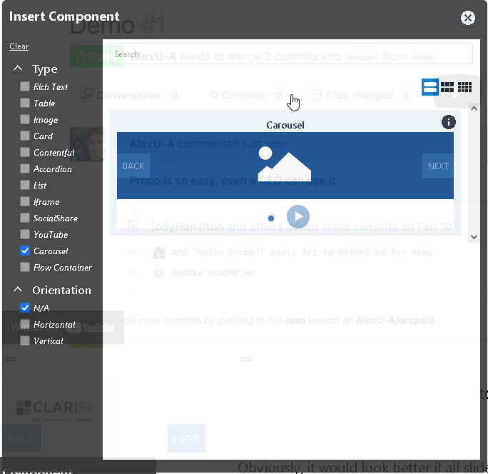
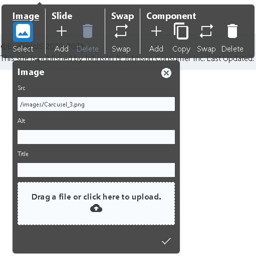
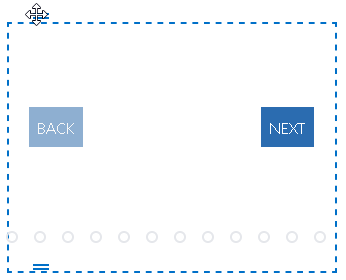

# Carousel Component

The simplest version of a carousel can contain an image component. But the Bodiless-JS
site builder allows site editors other components to place within the carousel. These
include such things as linkable images, videos, and cards.

## Content Editor Details

BodilessJS offers the option to add slides to a Carousel. Each slide has one
component.

### Place a Carousel

First, click the Insert Component button and select "Carousel" on the left side of the
window. To place a Carousel on your Website, click the Carousel image in the Insert
Component window. 

   This adds a Carousel component to your Website.

### Add Images to Carousel

Add an image to the slide by clicking on the placeholder image. Then, click
on the "Image" button on the tool bar. You can also drag a file to the image menu to
upload it to your site. This calls up the Image menu. BodilessJS will automatically 
add the path to the image in src. [Good search engine optimisation practice](https://blog.hubspot.com/marketing/image-alt-text)
is to enter a value for alt text that describes the image.

### Add Slides to Carousel

To add another slide, click the "Add" button under "Slide" in the toolbar. Repeat
thie step until you are finished adding slides.

### Resize Carousel

Resize the Carousel by clicking near the blue line on the right edge of it and
dragging to expand or contract.

### Move Carousel

Move the Carousel by clicking the two lines at the top left of it and
dragging to the desired place on your page.

