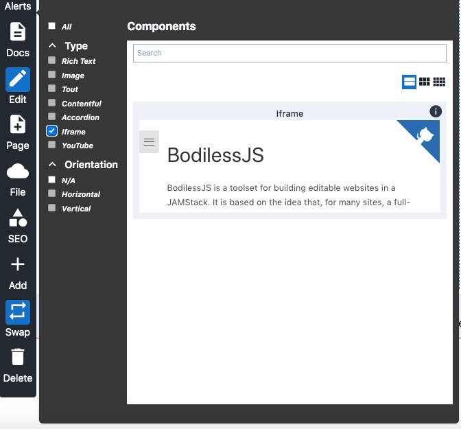
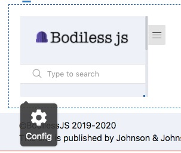
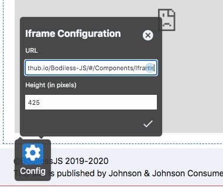

# Iframe Component

The Iframe Component can be used to place an iframe on a BodilessJS page. 
The iframe can be configured via the context menu. By default the height 
and the source URL for the iframe are editable. 

### Content Editor Details

To place an Iframe Component on a BodilessJS page:

1. Select the Iframe Component from the Component Library.



2. Click on the iframe component to toggle the configuration button for 
the iframe.




3. Enter the URL you wish to place in the iframe and enter the height at 
which you would like to display the iframe's content.

!> Please note that the originating site for the target URL must be configured 
to allow iframes. If the originating site does not allow embedding from their 
site the content will not display in the iframe.

?> If you do not enter a display height the iframe will default to 150 px



4. Click the check mark or hit enter.
 
5. Resize or reposition the iframe using the Flow Container controls.

---

## Site Builder Details

You can use this to compose and place an iframe on the page, that uses 
the BodilessJS edit interface.

To compose a base BodilessJS iframe component. 

  ``` js
  import React from 'react';
  import { asBodilessIframe } from '@bodiless/components';

  const Iframe = asBodilessIframe()('iframe');
  ```

Next, render the iframe component, passing nodeKey prop, which tells 
where to store the data (see [Data](Architecture/Data.md)); and src prop, 
which tells the default iframe src used when the src is not defined in Data.
You may pass other html element iframe props to the component.

  ``` jsx
  <Iframe nodeKey="iframe" src="https://johnsonandjohnson.github.io/Bodiless-JS/" />
 ```

By default, src and height fields are editable. You can compose your own 
BodilessJS iframe component defining custom editable fields. For example, 
you can make src and width editable. Import src snippet from @bodiless/components, 
compose width snippet and compose the custom `EditableWidthIframe` component.

  ``` js
  import {
    withNodeKey,
    withNode,
    withNodeDataHandlers,
    withEditFormSnippet,
    withoutProps,
    withData,
    useMenuOptionUI,
  } from '@bodiless/core';
  import { asBaseBodilessIframe, withIframeFormSrcSnippet, } from '@bodiless/components';
  import flowRight from 'lodash/flowRight';

  const withIframeWidthSnippet = flowRight(
    withNodeKey('width'),
    withNode,
    withNodeDataHandlers({width: '100%'}),
    withEditFormSnippet({
      renderForm: () => {
        const { ComponentFormLabel, ComponentFormText } = useMenuOptionUI();
        return (
          <React.Fragment key="width">
            <ComponentFormLabel htmlFor="width">Width</ComponentFormLabel>
            <ComponentFormText name="width" />
          </React.Fragment>
        );
      },
    }),
    withoutProps('setComponentData'),
    withData,
  );

  const EditableWidthIframe = flowRight(
    asBaseBodilessIframe(),
    withIframeFormSrcSnippet,
    withIframeWidthSnippet,
  )('iframe');

  ```

Then, we can render `EditableWidthIframe`

``` jsx
<EditableWidthIframe nodeKey="iframe" src="https://johnsonandjohnson.github.io/Bodiless-JS/" />
```

---

## Architectural Details

The Iframe Component renders:

```
<iframe src="string" height=""></iframe>
```

