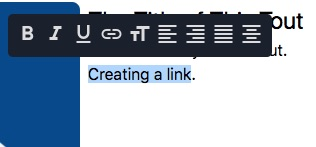

# Link Component

The Link Component allows you to easily add links to your site. Links can be
used within other components - such as touts, menus, and images to name a few.

## Content Editor Details

To add a Link:

1. In Edit mode, click on a component that utilizes link component. For example click on a linkable image.
 
2. In the context menu click on the Link icon.


3. In the Link form enter the URL which you want the link to direct to.


    ?> **Note**  Please note that you should use relative URLs for internal links (e.g.
    /Example/Example). For external links enter a fully formed URL (e.g.
    https://example.com).

4. Click the checkmark to finish applying the link. 

### Adding Links in Rich Text Editor

To add a link to text in the rich text editor (e.g. in the body copy of a Tout):

1. Highlight the text you want to add the link to.


2. In the Rich Text Editor tool bar select the link button.


3. Click on the highlighted text. The Link Component will appear in the context
menu.


4. In the link form, enter the link URL and click the checkmark.


## Architectural Details

One can use this to place a link (usually an `a` tag) on the page, that uses the
BodilessJS edit system and allow the href to be editable.

  ``` 
  js import Link from '@bodiless/components';

  <Link nodeKey="linkit">This is an editable Nodelink.</Link> 
  ```

One can also use the HOC version of this which can then be apply to other
components. But the underlining component must accept the same props as an `a`
tag. Simply pass the node key to the asBodilessLink function and then use the
returned HOC

  ```
  js import { CustomLink } from 'my-library'; import { asBodilessLink } from
  '@bodiless/components';

  const Link = asBodilessLink('linkit')(CustomLink)

  <Link>This is an editable Nodelink.</Link>
  ```

### withLinkToggle

A toggleable link with two states: 

- *On* - In this mode the component wraps its children in specified wrapper
component (in most cases [Link](#Link)) - *Off* - The component only renders its
children

In edit mode, the On/Off is controlled by a button exposed in local context
menu. 

**Usage:**

```
import { withLinkToggle, Editable, Link } from '@bodiless/components';

const LinkToggle = withLinkToggle(Link);

<LinkToggle nodeKey="linktoggle1"><Editable nodeKey="text" placeholder="Link
Toggle" /></LinkToggle>
```
