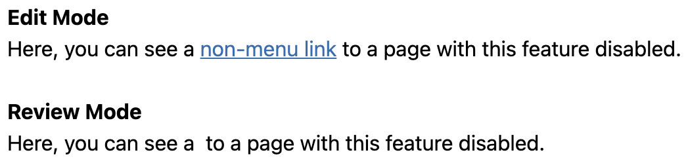

# Disable

From the [_Page_ menu](../), click the **Disable** button to disable various features of
the current page.

If any of the features on the page are disabled, the "Disable" button will be highlighted in blue.

To disable features:

01. Click the **Disable** button to open the _Disable Status_ submenu; this will present you with
    a list of features that you can disable.
    * By default, none of the features are disabled.
01. Select the checkbox of each feature that you would like to disable.
    * For information regarding the disablement of each feature, please see:
      * [Page](#disable-page)
        * [Menu links](#disable-menu-links)
        * [Non-menu links](#disable-non-menu-links)
        * [Indexing](#disable-indexing)
01. Click the checkmark in the bottom-right of the submenu to apply your selection.
    * As confirmation, you will be shown the current _Disable Status_ of the page.  
      
01. Click the "X" icon to close the submenu.

## Disable Page

Select the "Page" checkbox to select all the child feature checkboxes:

* [Menu links](#disable-menu-links)
* [Non-menu links](#disable-non-menu-links)
* [Indexing](#disable-indexing)

Likewise, to _deselect_ all the child feature checkboxes, deselect the "Page" checkbox.

## Disable Menu Links

To disable menu links leading to the current page, select the "Menu links" checkbox.

When disabled, any menu links targeting the current page will not be visible in Static or Review
Mode (i.e., for each of the affected links, neither the anchor element or the link text will be
rendered). Disabled menu links _will_, however, still be visible and functional in Edit Mode.

**Review Mode**  

**Edit Mode**  

?> **Note:** If a page is published, then it is reachable directly (via its URL) regardless of menu
links being disabled.

## Disable Non-Menu Links

To disable non-menu links leading to the current page, select the "Non-menu links" checkbox.

When disabled, any links targeting the current page — that aren't in menus — will not be visible in
Static or Review Mode (i.e., for each of the affected links, neither the anchor element or the link
text will be rendered). Disabled non-menu links _will_, however, still be visible and functional in
Edit Mode.

<!-- TODO: Pretty sure we're deleting this image. -->

?> **Note:** If a page is published, then it is reachable directly (via its URL) regardless of
non-menu links being disabled.

## Disable Indexing

?> **Note:** This feature is still under development.
