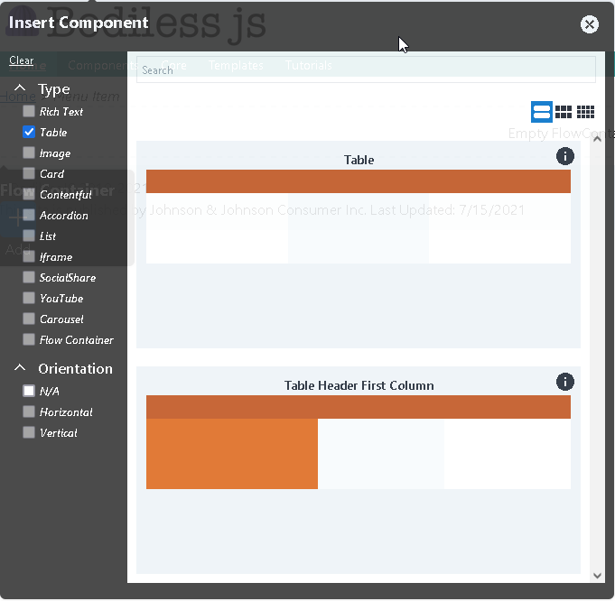
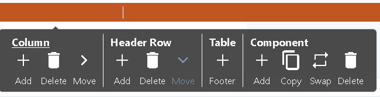
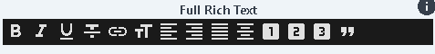
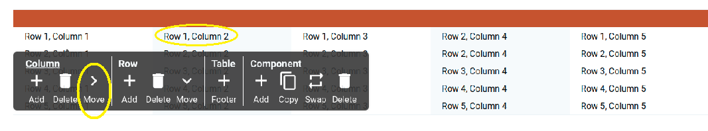
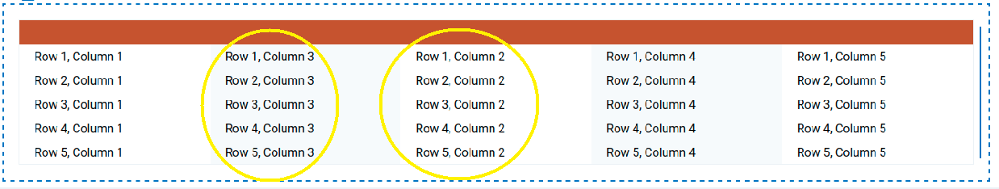
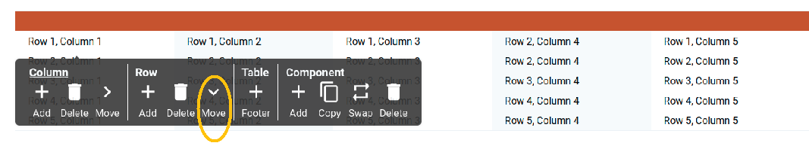
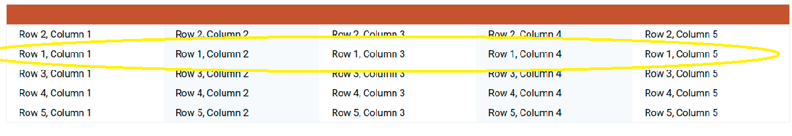

# Table Component

This tool allows you to place a table into a Bodiless site. It also allows you to
add, delete, or move rows and columns.

## Content Editor Details

Bodiless-JS allows you to insert two types of tables. One type has headers in the top
row, and other type has headers in a side column.

### Place a Table

First, click the Insert Component button and select "Table" on the left side of the
window. Click on the table to insert it into your Website.



### Name the Table

The top row of a table is called the Header. Click the header of the table and type
the name. You can also delete the header by clicking it and clicking the "Delete"
button.



### Adding Data to a Table

All new tables in Bodiless start with 3 columns and 3 rows. To add data to a cell,
click on the cell and start typing. Clicking tab will move the cursor one cell to
the right. You can format text in a cell using the same tools as in the Full Rich
Text editor.



### Working With Columns and Rows


You can add rows to a table by clicking on a row and then clicking the Add button
under Row on the Table toolbar. The new row will appear under the row where your
cursor was placed when you clicked Add. You can add columns by clicking the add
button under Column. The new column will appar to the right of the row where your
cursor was placed when you clicked Add.

To move a columm to the right, click in a cell and click the "Move" button under "Column." To move a row down, click in a cell and click the "Move" button under "Row." 



After you move Column 2 to the right, it switches places with Column 3.





After you move Row 2 down, it switches places with Row 1.



To remove a column or row, click a cell and select the Delete button under Column
Row. The selected column or row will vanish.

### Footer

Adding a footer inserts a final row that looks nornmal, but uses the `<ifoot>` tag.


---

## Site Builder Details

- Purpose
  - A way for editors to add tabular data.
- Editable areas
  - Allow for table Rows and Columns to be added deleted and moved
- Styling
  - Can be implemented in the appropriate token.tsx file by adding necessary tailwind classes - check [asTableDefaultStyle](../../examples/test-site/src/components/Table/index.tsx)

### Usage

``` js
const ExampleTableExample = flow(
  withDesign({
    Header: addClasses('text-center'),
  }),
  asBodilessTable(),
  asDefaultTableStyle,
)(CleanTable);
```

`asBodilessTable()` is used to add the editablity to the table.

``` js
 <TableExample nodeKey="table-1" />
```

### Design Components

The table component follows the Bodiless Design Pattern and is easy to style. Here is an example demonstrating all possible design components:

```js
import { withDesign, addClasses } from '@bodiless/fclasses';

const asTableExampleStyle = withDesign({
  Wrapper: addClasses('p-3'),
  THead: addClasses('bg-gray-200'),
  TBody: addClasses('text-primary'),
  TFoot: addClasses('ml-2'),
  Row: addClasses('ml-2'), 
  Cell: addClasses('border border-solid border-gray-200'),
  }),
});
```

Because each Cell knows where it is in the table it is possible to use conditional styling. There are several helper function for this or someone can provide a custom
function with all Cell Props as well as table data.

```js
import { withDesign, addClasses, addClassesIf, and, not } from '@bodiless/fclasses';
import { useIsFirstColumn, useIsOddColumnn } from '@bodiless/organisms';

const asTableExampleStyle = withDesign({
  Cell:  flow(
      /**
       * Here we apply a dark column to every other row in the Body, left align 
       * text in the first column and right align in every other column.
       */
      addClassesIf(and(useIsInBody, useIsOddColumnn))('bg-gray-200'),
      addClassesIf(useIsFirstColumn)('text-left'),
      addClassesIf(not(useIsFirstColumn))('text-center'),
      /**
       * Here we use a custom function. to style the second to last column
       */
      addClassesIf((p) => p.columnIndex === (p.tableData.columns.length - 2))('bg-color-orange-700'),
    ),
  }),
});
