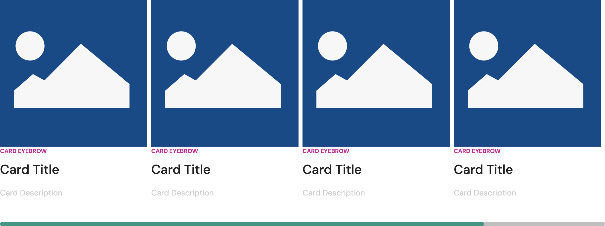
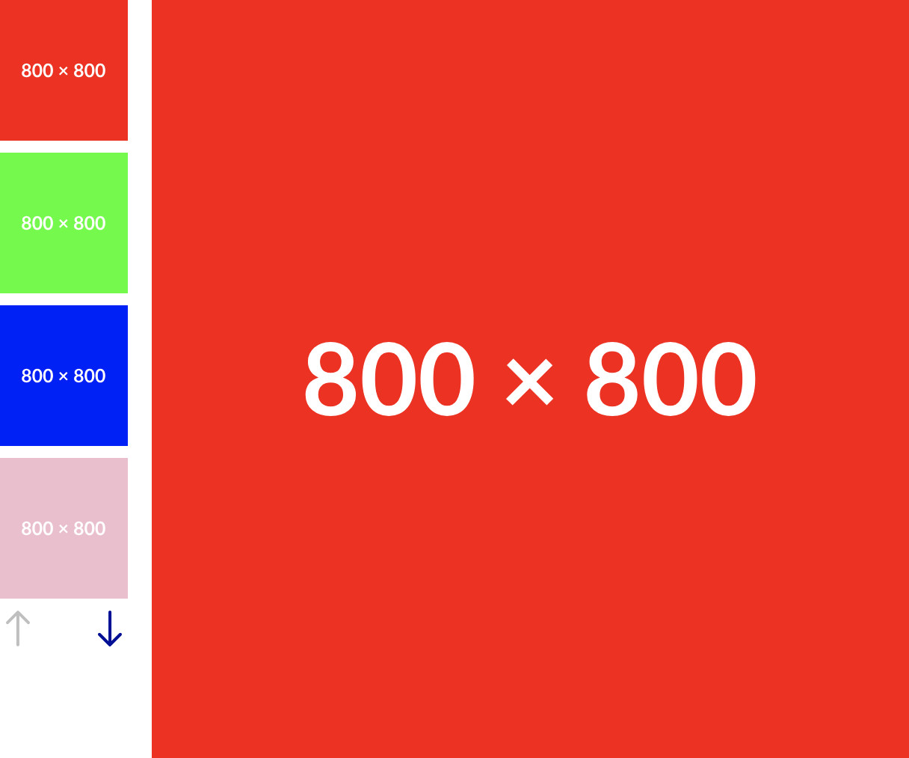
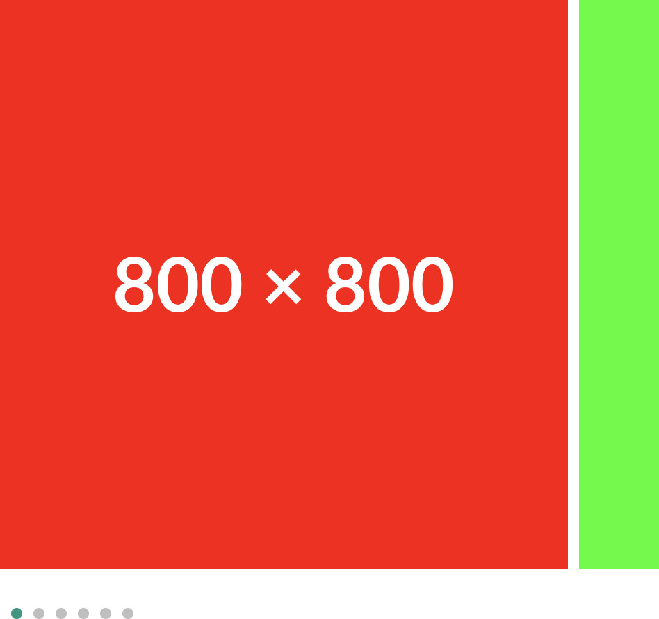

# Vital Carousel Component

The Vital Carousel Component can present a collection of a variety of components to your users as a
sequential slideshow. An image is the simplest (and default) example of a component that can be
displayed within a Vital Carousel, but Site Builders are able to provide Content Editors with other,
more complex components — like Linkable Images, Videos, and Cards.

## Component Variations

Using the tokens provided in the Vital Carousel package, a Site Builder can construct a number of
Carousel variations to meet your site's needs. Showcased below are a few examples:

### Horizontal Cards



This Carousel displays a horizontal lineup of [Cards](./VitalCard/), with a horizontal scrollbar to
handle any overflow.

A great use case for a Carousel like this would be for Product Cards in a "Product" section.

### Image Slides with Vertical Thumbnails Navigation



Here we have a Carousel with [Image](./VitalImage/) slides. Navigation between the slides is handled
via a vertical strip of thumbnails and two opposing arrow buttons.

This type of Carousel would be good for displaying Product Images on a Product Display Page (PDP).

### Image Slides with Vertical Dots Navigation



This Carousel, like the previous example, also uses [Image](./VitalImage/) slides. Here, horizontal
overflow is used to show a portion of the next slide, and navigation is handled via clickable dots.

This variation would be ideal for a mobile layout, especially when paired with using something like
the [previous example](#image-slides-with-vertical-thumbnails-navigation) as the corresponding
variation for the desktop layout.

## Content Editor Details

The Vital Carousel Component Edit UI allows you to add, move, and delete slides, as well as swap the
type of component used for the slides in the Carousel (e.g., Card, Video, etc.).

### Add a Carousel

?> **Note:** These instructions assume that a Site Builder has configured your site and/or page so
that you can add Vital Carousel Components via [Flow Containers](../../Components/FlowContainer/)
using the Edit UI.

To add a Vital Carousel Component to your page:

01. While in [Edit Mode](../../ContentEditorUserGuide/#edit-mode), select a [Flow
    Container](../../Components/FlowContainer/), and, within its context menu, under "Component,"
    click **Add** (or **Swap**, if you're replacing a component).
01. In the "Insert Component" modal, under "Type," check the "Carousel" checkbox, and select the
    Carousel variation you would like to add.
    - See details about the Vital Carousel variations under [Component
      Variations](#component-variations).
    - Hover over the "i" icon for information about a particular Carousel variation.

### Edit a Carousel

?> **Note:** Depending on how your site and/or page is configured, you may be able to edit Vital
Carousels that you, or another Content Editor, have [added](#add-a-carousel). However, you may only
be able to edit Carousels that have been added by a Site Builder.

As mentioned, a Vital Carousel displays a collection of components as sequential slides in a
slideshow; with this in mind, when editing a Carousel, you'll either be editing individual slides
(i.e., components) or the slideshow itself (i.e., adding, deleting, or removing slides).

#### Edit a Slide/Component

To edit a slide/component within a Vital Carousel:

01. While in [Edit Mode](../../ContentEditorUserGuide/#edit-mode), select the slide/component of a
    Vital Carousel you'd like to edit.
01. Once selected, you'll see the section for your selected component within the context menu, and
    you can then edit that component as you would normally.
    - For example, if your Carousel contains a collection of Images, selecting one will present an
      "Image" section within the context menu.  
      

#### Edit the Slideshow

To edit a Vital Carousel's slideshow itself:

01. While in [Edit Mode](../../ContentEditorUserGuide/#edit-mode), select the Vital Carousel you'd
    like to edit.
    - Depending on the action(s) you wish to take from the context menu in the next step, you'll
      actually want to select a specific slide.
01. Within the context menu, you'll see a "Slide" section, allowing you to configure the slideshow.  
    
    - **Move:** The left and right **Move** arrows will move the selected slide to the previous or
      next position in the slide sequence, respectively.
    - **Add:** Create a new slide (component) in the position _after_ the selected slide.
    - **Delete:** Remove the selected slide.

<!-- Inlining HTML to add multi-line info block with ordered list. -->
<div class="warn">
  <strong>Note:</strong> To add a new slide to the first position in the Carousel:

  01. Select the first slide, and **Add** a slide to the second position.
  01. With the first slide still selected, click the right **Move** arrow, moving the first slide to
      the second position and your newly added slide to the first.

</div>

## Site Builder Details

### Usage

For examples of using the Vital Carousel, please see:

- [`packages/vital-demo/src/styleguide/Page/StyleGuideTemplate/Carousel.tsx`](https://github.com/johnsonandjohnson/Bodiless-JS/blob/main/packages/vital-demo/src/styleguide/Page/StyleGuideTemplate/Carousel.tsx ':target=_blank')
  - To see this page in action, run the Vital Demo Next site in `dev` mode, and go to
    <http://localhost:8000/styleguide/carousel/> in your browser.
    ```shell
    cd sites/vital-demo-next
    npm run dev
    ```
